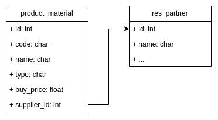

# Backend Odoo Test

`Module Odoo 14`

## ERD
> ERD can be seen in the `static/src/image` folder

## Models
> Product Template, with field:
- `code`: `char`
- `name`: `char`
- `type`: `char` with `selection`: `['Fabric', 'Jeans', 'Cotton']`
- `buy_price`: `float` bigger than 100.0
- `supplier_id`: `int` foreign key with `res_partner` model

## Controllers
> Controllers load link to:
- get all records product_material
- get specific record product_material
- update record product_material
- delete record product_material

## Unit Testing
> run unit testing with command `odoo-bin -i product_template -d <database_name> --test-enable`

> ensure user can't create or update record product_material with value of `buy_price` field < 100.0
